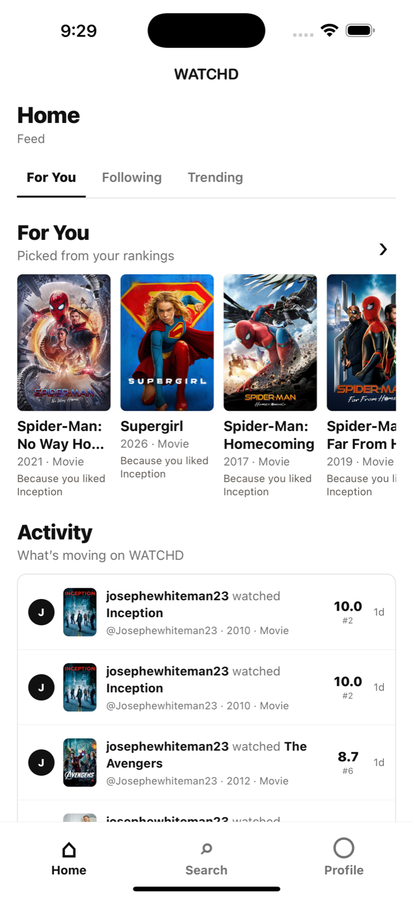
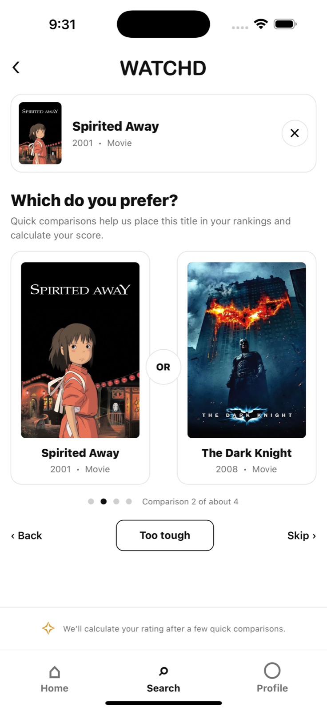
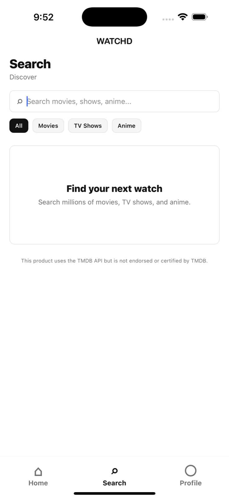
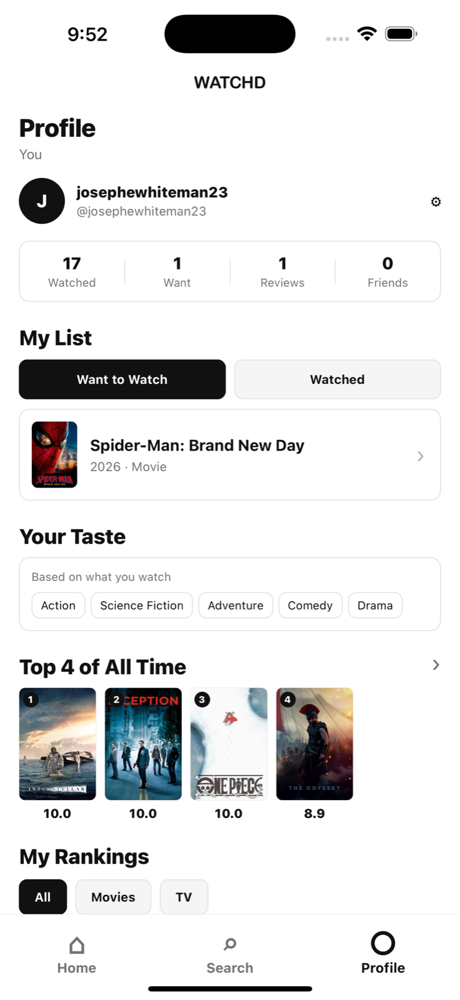

# WATCHD

**Beli for movies, TV shows, and anime.**

WATCHD is a social discovery and ranking app for everything people watch. Instead
of forcing users to invent a number for every title, WATCHD asks simple pairwise
questions—*Which did you prefer?*—and turns those choices into a personal rating
from 1.0 to 10.0. Users can discover real titles, record what they watched, build
rankings, write reviews, follow friends' activity, and receive recommendations
with clear reasons.

## Introduction to the Project

### Why was WATCHD chosen?

Choosing something to watch is a familiar problem, but the available tools often
split the experience into separate products: one app for searching, another for
lists, another for reviews, and group chats for recommendations from friends.
WATCHD was chosen as a way to bring those actions into one focused mobile app.
The idea is **Beli, but for movies and shows**: a social experience built around
personal taste rather than a single universal rating.

### Why is it cool?

People usually know whether they preferred one title to another even when they
cannot confidently decide whether something deserves a 7.8 or an 8.2. WATCHD
uses that easier comparison to place a title within the user's existing ranking
and calculate a one-decimal score. The result feels personal: two people can
watch the same movie and build different rankings without either opinion being
treated as wrong.

WATCHD also connects ranking to discovery. The app uses a person's scores,
watch history, genres, and social signals to suggest more titles, explains why a
recommendation appeared, and keeps TMDb search and trending data current.

### Why does a good predictive model matter?

A useful predictive model can reduce choice overload and help people spend less
time browsing and more time watching something they are likely to enjoy. It can
also surface older, niche, international, or genre-specific titles that would be
missed by a popularity-only list. Explanations such as “Because you liked
Inception” make recommendations easier to trust and evaluate.

Prediction also carries responsibility. A weak model can create repetitive
feedback loops, overvalue popular content, or make cold-start users feel unseen.
WATCHD therefore treats prediction as an aid rather than a final authority:
recommendations include reasons, users retain control of their lists and scores,
and future models should be evaluated for accuracy, diversity, privacy, and
serendipity—not engagement alone.

## Features

- Supabase email/password authentication with JWT-protected FastAPI routes
- Username-based profiles, friend connections, and social activity feed
- Live movie and TV search, details, posters, and trends from TMDb
- Want to Watch, Currently Watching, and Watched status tracking
- “Did you enjoy the WATCHD?” input followed by pairwise title comparisons
- Personal rankings and stable 1.0–10.0 scores with one decimal place
- Manual score editing and written reviews
- Personalized recommendations with human-readable reasons
- Friends-only activity plus current TMDb trending content
- Paginated feeds, recommendation lists, retry states, and pull-to-refresh
- Backend tests, Docker packaging, and GitHub Actions continuous integration

## Screenshots

These screenshots are from the current Part 13 iOS build and use live TMDb
poster data.

| Home — Feed & Recommendations | Add/Rate — Compare Titles |
| --- | --- |
|  |  |

| Search — Discover Titles | Profile — Lists & Rankings |
| --- | --- |
|  |  |

The Add experience is now part of Search: selecting any title opens its shared
detail page, where the user can update a list status, mark it watched, and enter
the comparison flow shown above. Profile contains the user's lists, rankings,
reviews, stats, and friends.

## Architecture Summary

WATCHD separates the mobile client, API, catalog provider, authentication, and
database responsibilities:

```text
React Native / Expo app
  ├── Supabase Auth ── issues user session and JWT
  └── FastAPI ─────── verifies JWT and runs application logic
          ├── Supabase Postgres ── users, titles, events, scores, and social data
          └── TMDb API ─────────── search, metadata, posters, and trending titles
```

The root navigator gates the app using the Supabase session. Logged-out users see
the Welcome, Login, and Signup stack; logged-in users see Home, Search, and
Profile. Home owns feed and recommendation views. Search owns title discovery,
details, status actions, comparisons, reviews, and score editing. Profile owns
personal lists, rankings, stats, and friend management.

Backend requests follow `router → service → model/database`. FastAPI routers
validate HTTP input, services hold business rules and database queries, and the
authentication module verifies Supabase JWTs. On the frontend, screens call
typed API functions through a shared client while reusable components render the
app's warm, minimal WATCHD design system.

## Technology Stack

- **Mobile:** React Native, Expo, TypeScript, React Navigation, TanStack Query
- **API:** FastAPI, Python, SQLModel, Pydantic
- **Data and auth:** Supabase Auth and PostgreSQL
- **Catalog:** TMDb Movie and TV API
- **Quality:** pytest, Docker, GitHub Actions

## Project Structure

```text
beli-movies/
├── frontend/
│   └── src/
│       ├── api/          # typed FastAPI client functions
│       ├── auth/         # Supabase session and auth gate
│       ├── components/   # reusable WATCHD UI
│       ├── navigation/   # auth, tabs, and nested screen stacks
│       ├── screens/      # screen layout and data orchestration
│       └── types/        # shared TypeScript models
├── backend/
│   ├── app/
│   │   ├── api/          # FastAPI routers
│   │   ├── core/         # settings and JWT verification
│   │   ├── models/       # SQLModel database models
│   │   └── services/     # domain and integration logic
│   └── tests/            # isolated backend tests
├── docs/                 # detailed project documentation
└── .github/workflows/    # backend continuous integration
```

## Final Local Setup

### Prerequisites

- Python 3.12+
- Node.js and npm
- Expo-compatible iOS Simulator, Android emulator, or physical device
- Supabase project with Auth and Postgres
- TMDb API read-access token
- Docker Desktop (optional for containerized backend)

### 1. Configure and run the backend

From the repository root:

```bash
cd backend
python3 -m venv .venv
source .venv/bin/activate
pip install -r requirements.txt
cp .env.example .env
```

Fill in `backend/.env`:

```dotenv
DATABASE_URL=postgresql://...
SUPABASE_JWKS_URL=https://your-project-ref.supabase.co/auth/v1/keys
SUPABASE_ISSUER=https://your-project-ref.supabase.co/auth/v1
SUPABASE_AUDIENCE=authenticated
TMDB_READ_ACCESS_TOKEN=your-private-token
```

Then start FastAPI:

```bash
uvicorn app.main:app --reload
```

The API is available at `http://127.0.0.1:8000`. Verify `/health`, then open
`/docs` for FastAPI's interactive API reference.

### 2. Configure and run the frontend

In another terminal, from the repository root:

```bash
cd frontend
npm install
cp .env.example .env
```

Fill in `frontend/.env`:

```dotenv
EXPO_PUBLIC_SUPABASE_URL=https://your-project-ref.supabase.co
EXPO_PUBLIC_SUPABASE_ANON_KEY=your-supabase-anon-key
EXPO_PUBLIC_API_BASE_URL=http://your-computer-lan-ip:8000
```

Start Expo:

```bash
npm start
```

Press `i` for iOS or `a` for Android. A physical phone must use the computer's
LAN IP for `EXPO_PUBLIC_API_BASE_URL`; `localhost` points back to the phone.

> [!IMPORTANT]
> Never commit `backend/.env` or `frontend/.env`. Both are ignored by Git. Only
> placeholder `.env.example` files belong in the repository, and TMDb secrets
> remain on the backend rather than being bundled into the mobile app.

## Tests

The backend suite uses an isolated in-memory SQLite database, mocked
authentication, and fixed TMDb responses. It does not require real Supabase,
TMDb, JWT, or production database credentials.

```bash
cd backend
source .venv/bin/activate
pytest
```

Coverage focuses on protected routes, event statuses and user isolation,
pairwise ranking, personal scoring, recommendation reasons and exclusions,
pagination, and important service regressions.

## Docker and Continuous Integration

Build and run the FastAPI backend from `backend/`:

```bash
docker build -t watchd-backend .
docker run --name watchd-backend --env-file .env -p 8000:8000 watchd-backend
```

Runtime secrets are supplied through environment variables and are not copied
into the image. GitHub Actions runs the backend pytest suite on every push and
pull request. Part 13 was verified with a successful local Docker image and a
green **Backend CI** workflow run.

## Documentation

- [API reference](docs/api.md)
- [Authentication and JWT flow](docs/auth.md)
- [Ranking and scoring](docs/ranking.md)
- [Recommendations and reasons](docs/recs.md)
- [Docker and deployment guide](docs/deploy.md)
- [Architecture](docs/architecture.md)
- [Performance and stability](docs/performance.md)
- [TMDb integration](docs/tmdb.md)
- [WATCHD design system](docs/design.md)

## Project Progress

- **Part 1 — Foundation:** repository structure, FastAPI health endpoint, Expo
  application, and initial documentation.
- **Part 2 — Database:** Supabase PostgreSQL connection, SQLModel session,
  initial domain models, and database health check.
- **Part 3 — Titles and navigation:** title APIs, seed catalog, title detail
  routes, and the initial mobile navigation model.
- **Part 4 — Authentication:** Supabase signup/login, JWT-gated navigation,
  backend token verification, user upsert, and authenticated `/me`.
- **Part 5 — Events and My List:** Want to Watch, Watched, and Currently Watching
  events plus grouped personal lists.
- **Part 6 — Friends and activity:** username-based mutual friendships,
  activity creation, social feed, and friend management.
- **Part 7 — Cleanup and UI polish:** thinner routers, domain services, shared
  frontend client/types/components, resilient states, and consistent WATCHD UI.
- **Part 8 — Comparisons and scoring:** enjoyment input, pairwise ranking,
  comparison history, Too Tough/Skip handling, and calculated decimal scores.
- **Part 9 — Profile and rankings:** personal stats, filtered score-ordered
  rankings, saved lists, reviews, and profile states.
- **Part 9.5 — TMDb integration:** live movie/TV search, metadata, posters,
  trending content, backend-only credentials, and local title import.
- **Part 10 — Recommendations and rating controls:** personalized reasons,
  expanded For You and Trending views, Following state, stable scoring,
  manual score edits, and review writing.
- **Part 11 — Performance and stability:** database indexes, bounded pagination,
  batched relationship queries, cache-aware mobile data, and retry/refresh flows.
- **Part 12 — Backend tests:** isolated coverage for authentication, events,
  rankings, recommendations, pagination, and core service logic.
- **Part 13 — CI and Docker:** production-style backend image, runtime secret
  handling, container verification, and green GitHub Actions backend CI.

## Conclusion and Future Directions

WATCHD began as a simple “Beli for movies” idea, but the comparison system made
it more interesting than a standard watchlist. My favorite part of the project
is that it turns a vague opinion into an understandable personal ranking without
pretending taste is objective. Building the full path—from Supabase identity and
Postgres data to TMDb discovery, social activity, recommendation reasons, tests,
and Docker—also made the project feel like a real product rather than a collection
of disconnected screens.

There is still meaningful work ahead. The current recommendation logic is a
deterministic, explainable system built from rankings, genres, watch history, and
social signals; it is not yet a trained machine-learning model. With enough
privacy-respecting interaction data, a future hybrid model could combine these
signals with collaborative filtering or embeddings. I would evaluate it not
only on prediction accuracy but also on novelty, catalog diversity, cold-start
quality, and whether its explanations remain honest.

### Planned Part 14 — Production Deployment

Part 14 has **not** been completed yet. The planned next step is to:

1. Create an AWS Elastic Beanstalk application using the Docker platform.
2. Configure `DATABASE_URL`, `SUPABASE_JWKS_URL`, `SUPABASE_ISSUER`,
   `SUPABASE_AUDIENCE`, and the TMDb credential as protected environment values.
3. Deploy the FastAPI Docker image and verify health, database, auth, search,
   and recommendation endpoints over HTTPS.
4. Point `EXPO_PUBLIC_API_BASE_URL` at the production API and run an end-to-end
   mobile smoke test.
5. Update the deployment guide with the final production URL and operational
   steps.

Beyond deployment, possible directions include taste-overlap views for friends,
notifications, richer review conversations, spoiler controls, stronger
moderation and privacy tools, production database migrations, observability,
and a more diverse recommendation model that deliberately leaves room for
surprise.

## Data Attribution

This product uses the TMDb API and TMDb images but is not endorsed or certified
by TMDb.
